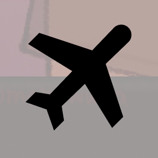
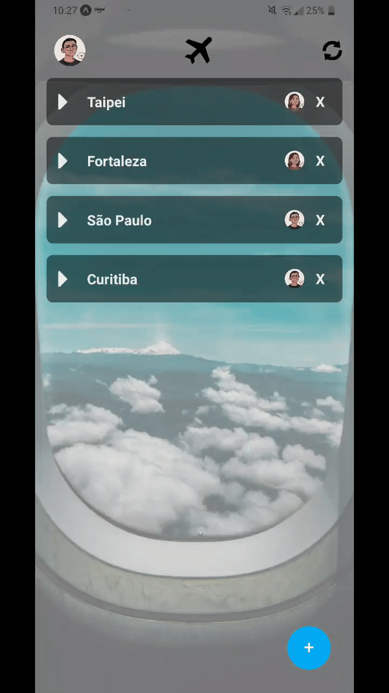
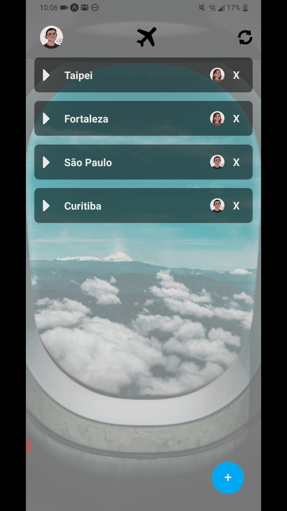

<h1 align="center">
 
  
 
 
Places 2 Go
</h1>

Aplicativo feito para organizar lugares para ir e coisas para fazer. Também permite ver fotos de fotógrafos profissionais referentes aos destinos escolhidos.

  
  

  
  
Splash Screen

  
  
Adicionar lugar

  
  
Adicionar lugar aleatório utilizando a API do GeoDB

  
  
Lista de tarefas referentes a um lugar

  
  
Fotos do lugar utilizando a API do Unsplash

## Tecnologias utilizadas 🛠

Esse projeto foi desenvolvido com as seguintes tecnologias:

- ✔️ Typescript

- ✔️ Expo

- ✔️ React Native

- ✔️ React Hooks

- ✔️ React Navigation

- ✔️ Axios

- ✔️ Firebase

- ✔️ Unsplash API

- ✔️ GeoDB API

Feito por Gustavo Kumasawa :wave: [ Entrar em contato](https://www.linkedin.com/in/gustavo-kumasawa-0b2252173/)